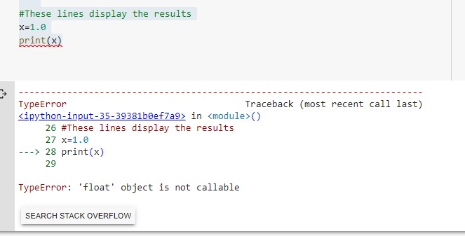

# Lab 1 – Calculations with Python

### *The Issue*
Impervious surfaces like asphault and concrete increase stormwater runoff.  The creation of these non-porious surfaces by paving over agricultural land pose many issues. These problems include:
 - ###### *Greater susceptibility to landslides and flooding which cause property damage and erosion*
 - ###### *Decreased ability to replenish groundwater supply*
 - ###### *Hastens pollution of waterways*
 
If systems are put in place, stormwater runoff can be **captured and recycled**.  This decreases the risks listed above and presents an opportunity for the public to access this water.  Knowing the amount of water that comes off of a plot of developed land, given daily rainfall, could be valuable information for risk assessment as well as the development of a stormwater catchment system to recycle the water.  The precise number of gallons of water during a storm is important information for the design of the catchment system.  In areas of the world where access to water is scarce and development of impervious surfaces is occurring, the code within the repository may be useful.

### *Case and Code*

In [Kenya](https://www.reuters.com/article/us-health-coronavirus-kenya-water/taps-run-dry-in-kenyas-capital-as-coronavirus-spreads-idUSKBN22Q2JN)

### *Major Errors and Resolution*

While building this code, I came across a syntax error multiple times.  This error occurred every time I attempted to execute my code with a print statement.  The error stated a **TypeError in <>() module** and that the **'float' object is not callable**.  In debugging this code, I commented out my entire code except for one variable assignment and the print statement for this variable.  I recieved the same TypeError in the () module.  I further simplified my code as shown in the following image and recieved the same error.

My solution to this was that I copy and pasted my entire codeblock into a new Google Colab notebook.  By doing this, the print statements executed with no issues.

###### Author:  Mitchell Lazarz
###### Creation Date: 29 August 2020
###### Python Version Used:  Python 3---Google Colab---Jupytor Notebooks
